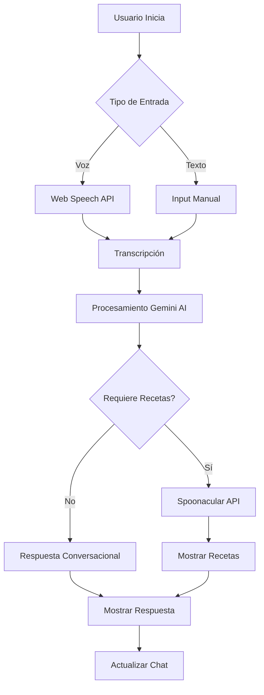

# 🍽️ Asistente de Cocina con IA y Voz

<div align="center">


**Prueba Técnica para Artificial Nerds**

*Una aplicación web moderna de asistente de cocina con reconocimiento de voz y búsqueda inteligente de recetas*

[Demo](#-demo) • [Características](#-características) • [Instalación](#-instalación) • [Uso](#-uso)

</div>

---

## 📋 Descripción del Proyecto

Esta aplicación es un asistente de cocina virtual interactivo que combina el poder de la inteligencia artificial conversacional de **Google Gemini** con la extensa base de datos de recetas de **Spoonacular API**. Los usuarios pueden interactuar mediante voz o texto para buscar recetas, obtener sugerencias culinarias y explorar nuevas ideas de cocina.

### 🎯 Objetivo

Desarrollar una interfaz intuitiva y accesible que permita a los usuarios descubrir y explorar recetas mediante comandos de voz naturales en español, demostrando la integración efectiva de APIs modernas de IA y servicios web.

---

## ✨ Características

### 🎤 Reconocimiento de Voz
- Implementación del **Web Speech API** para interacción por voz en tiempo real
- Soporte nativo para español (es-ES)
- Transcripción en tiempo real con feedback visual
- Manejo robusto de errores y permisos de micrófono

### 🤖 IA Conversacional
- Integración con **Google Gemini API** para respuestas contextuales inteligentes
- Procesamiento de lenguaje natural para entender intenciones del usuario
- Generación de respuestas personalizadas sobre recetas y cocina

### 🍳 Búsqueda de Recetas
- Conexión directa con **Spoonacular API**
- Búsqueda inteligente basada en ingredientes y preferencias
- Visualización de recetas con imágenes, tiempos de preparación y valores nutricionales
- Enlaces directos a recetas completas

### 🎨 Diseño Moderno
- Interfaz responsive con diseño mobile-first
- Paleta de colores inspirada en alimentos frescos
- Animaciones fluidas y micro-interacciones
- Tema visual consistente y atractivo

### 💬 Chat Interactivo
- Historial de conversación en tiempo real
- Diferenciación visual entre mensajes del usuario y del asistente
- Indicadores de estado y carga
- Formato de mensajes con timestamps

---

## 🛠️ Stack Tecnológico

| Tecnología | Versión | Propósito |
|------------|---------|-----------|
| **Vue.js** | 3.5.x | Framework JavaScript progresivo para UI reactiva |
| **Vite** | 7.x | Build tool y servidor de desarrollo ultrarrápido |
| **TailwindCSS** | 3.x | Framework CSS utility-first para estilos |
| **Web Speech API** | Nativa | Reconocimiento de voz del navegador |
| **Google Gemini API** | - | Modelo de IA conversacional |
| **Spoonacular API** | - | Base de datos de recetas y nutrición |

---

## 📁 Estructura del Proyecto

```
asistente-comida-vue/
├── src/
│   ├── assets/
│   │   └── main.css              # Estilos globales y variables CSS
│   ├── components/
│   │   ├── VoiceInput.vue        # Componente de entrada de voz y texto
│   │   ├── ChatDisplay.vue       # Componente de chat conversacional
│   │   └── RecipeCard.vue        # Tarjeta de visualización de recetas
│   ├── services/
│   │   ├── api.js                # Servicio de integración Spoonacular
│   │   └── gemini.js             # Servicio de integración Gemini
│   ├── App.vue                   # Componente raíz de la aplicación
│   └── main.js                   # Punto de entrada de Vue
├── index.html                    # Template HTML principal
├── vite.config.js                # Configuración de Vite
├── tailwind.config.js            # Configuración de Tailwind
├── postcss.config.mjs            # Configuración de PostCSS
├── package.json                  # Dependencias y scripts
└── .env                          # Variables de entorno (no incluido)
```

### 📦 Componentes Principales

#### `VoiceInput.vue`
- Maneja la captura de voz y entrada de texto
- Gestiona el ciclo de vida del reconocimiento de voz
- Emite eventos de transcripción y envío de mensajes
- Muestra estado de escucha y errores

#### `ChatDisplay.vue`
- Renderiza el historial de conversación
- Diferencia visualmente mensajes de usuario y bot
- Incluye indicador de carga animado
- Formatea timestamps de mensajes

#### `RecipeCard.vue`
- Visualiza información de recetas individuales
- Muestra imagen, tiempo de preparación y porciones
- Lista ingredientes principales
- Proporciona enlaces a recetas completas

#### Servicios

**`api.js`**
```javascript
// Búsqueda de recetas por ingredientes
searchRecipes(query)
// Obtención de detalles de receta
getRecipeDetails(id)
```

**`gemini.js`**
```javascript
// Generación de respuestas conversacionales
generateAIResponse(message, recipes)
```

---

## 🚀 Instalación

### Prerequisitos

- **Node.js** >= 18.0.0
- **npm** >= 9.0.0
- Navegador moderno (Chrome, Edge, Safari) con soporte para Web Speech API

### Pasos de Instalación

1. **Clonar el repositorio**
   ```bash
   git clone https://github.com/johernandezvaz/asistente-comida-vue.git
   cd asistente-comida-vue
   ```

2. **Instalar dependencias**
   ```bash
   npm install
   ```

3. **Configurar variables de entorno**

   Crear archivo `.env` en la raíz del proyecto:
   ```env
   VITE_GEMINI_API_KEY=tu_clave_gemini_aqui
   VITE_SPOONACULAR_API_KEY=tu_clave_spoonacular_aqui
   ```

4. **Obtener claves API**

    - **Gemini API**: Visita [Google AI Studio](https://makersuite.google.com/app/apikey)
    - **Spoonacular API**: Visita [Spoonacular Console](https://spoonacular.com/food-api/console#Dashboard)

5. **Iniciar servidor de desarrollo**
   ```bash
   npm run dev
   ```

   La aplicación estará disponible en `http://localhost:5173`

---

## 💻 Uso

### Interacción por Voz

1. Haz clic en el botón del micrófono (🎙️)
2. Permite el acceso al micrófono cuando el navegador lo solicite
3. Habla claramente en español
4. El botón cambiará a modo escucha (🎤) con animación
5. Tu mensaje se transcribirá automáticamente

### Ejemplos de Comandos

```
"Dame una receta con pollo y arroz"
"Busca recetas vegetarianas con tomate"
"Quiero cocinar algo con pasta"
"Recetas fáciles para principiantes"
"Postres con chocolate"
```

### Interacción por Texto

1. Escribe tu mensaje en el campo de entrada
2. Presiona Enter o haz clic en "Enviar"
3. El asistente procesará tu solicitud

### Explorar Recetas

- Las recetas aparecerán como tarjetas visuales
- Haz clic en "Ver Receta" para acceder a instrucciones completas
- Usa "Guardar" para marcar recetas favoritas

---

## 🎨 Sistema de Diseño

### Paleta de Colores

La paleta está inspirada en ingredientes frescos y vibrantes:

| Color | Hexadecimal | Uso |
|-------|-------------|-----|
| 🍅 Tomate | `#ff6b6b` | Color primario, acciones principales |
| 🍊 Naranja | `#ff9f43` | Color de acento, gradientes |
| 🥑 Aguacate | `#26de81` | Color secundario, confirmaciones |
| 🍋 Limón | `#fed330` | Destacados y alertas |
| 🥛 Crema | `#fff5e6` | Fondo cálido |
| ⚫ Carbón | `#2d3436` | Texto principal |

### Variables CSS Personalizadas

```css
:root {
  --color-primary: #ff6b6b;
  --color-secondary: #26de81;
  --color-background: #fafbfc;
  --color-surface: #ffffff;
  --radius-xl: 2rem;
  --shadow-md: 0 4px 16px rgba(0,0,0,0.12);
}
```

### Principios de Diseño

- **Espaciado Consistente**: Sistema basado en múltiplos de 8px
- **Tipografía Clara**: Fuentes del sistema para mejor rendimiento
- **Feedback Visual**: Animaciones suaves y estados interactivos
- **Accesibilidad**: Alto contraste y elementos semánticos

---

## 🧪 Scripts Disponibles

```bash
# Desarrollo
npm run dev          # Inicia servidor de desarrollo con HMR

# Producción
npm run build        # Genera build optimizado para producción
npm run preview      # Previsualiza build de producción localmente
```

---

## 🔐 Consideraciones de Seguridad

- Las claves API nunca deben incluirse en el código fuente
- Usar variables de entorno para información sensible
- El archivo `.env` debe estar en `.gitignore`
- Las claves deben rotarse periódicamente
- Implementar límites de rate en producción

---

## 🌐 Compatibilidad de Navegadores

| Navegador | Versión Mínima | Soporte de Voz |
|-----------|----------------|----------------|
| Chrome | 89+ | ✅ Completo |
| Edge | 89+ | ✅ Completo |
| Safari | 14.1+ | ✅ Completo |
| Firefox | 88+ | ⚠️ Limitado |

*Nota: El Web Speech API tiene soporte variable entre navegadores. Chrome/Edge ofrecen la mejor experiencia.*

---

## 📊 Flujo de la Aplicación



---

## 🚧 Limitaciones Conocidas

- El reconocimiento de voz requiere conexión a internet
- Spoonacular API tiene límites de peticiones diarias en plan gratuito
- El reconocimiento de voz funciona mejor en ambientes silenciosos
- Algunos navegadores pueden requerir conexión HTTPS para usar el micrófono

---

## 🔮 Mejoras Futuras

- [ ] Implementar almacenamiento local de recetas favoritas
- [ ] Añadir soporte multiidioma
- [ ] Integrar filtros dietéticos (vegetariano, vegano, sin gluten)
- [ ] Implementar sistema de recomendaciones personalizadas
- [ ] Añadir modo oscuro
- [ ] Incluir planificación de menús semanales
- [ ] Exportar listas de compras

---

## 👨‍💻 Autor

**José de Jesús Hernández Vázquez**

Desarrollador Full Stack | Vue.js Specialist

*Proyecto desarrollado como prueba técnica para Artificial Nerds*

---

## 📝 Licencia

Este proyecto fue desarrollado con fines educativos y de evaluación técnica.

---

## 🙏 Agradecimientos

- **Artificial Nerds** - Por la oportunidad de desarrollo
- **Google Gemini** - Por proporcionar capacidades de IA conversacional
- **Spoonacular** - Por su extensa base de datos de recetas
- **Vue.js Community** - Por el excelente framework y documentación

---

<div align="center">

**Desarrollado con ❤️ y ☕ para Artificial Nerds**

*Prueba Técnica - 2025*

</div>
