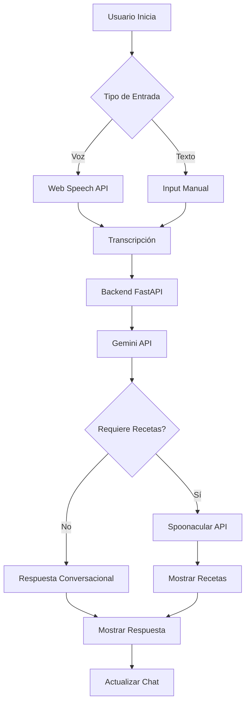

# 🍽️ Asistente de Cocina con IA y Voz

<div align="center">


**Prueba Técnica para Artificial Nerds**

*Una aplicación web moderna de asistente de cocina con reconocimiento de voz y búsqueda inteligente de recetas*

[Demo](#-demo) • [Características](#-características) • [Instalación](#-instalación) • [Uso](#-uso)

</div>

---

## 📋 Descripción del Proyecto

Esta aplicación es un asistente de cocina virtual interactivo que combina el poder de la inteligencia artificial conversacional de **Google Gemini** con la extensa base de datos de recetas de **Spoonacular API**. Los usuarios pueden interactuar mediante voz o texto para buscar recetas, obtener sugerencias culinarias y explorar nuevas ideas de cocina.

### 🎯 Objetivo

Desarrollar una interfaz intuitiva y accesible que permita a los usuarios descubrir y explorar recetas mediante comandos de voz naturales en español, demostrando la integración efectiva de APIs modernas de IA y servicios web.

---

## ✨ Características

### 🎤 Reconocimiento de Voz
- Implementación del **Web Speech API** para interacción por voz en tiempo real
- Soporte nativo para español (es-ES)
- Transcripción en tiempo real con feedback visual
- Manejo robusto de errores y permisos de micrófono

### 🤖 IA Conversacional
- Integración con **Google Gemini API** para respuestas contextuales inteligentes
- Backend en **FastAPI** que maneja las peticiones a Gemini de forma segura
- Procesamiento de lenguaje natural para entender intenciones del usuario
- Generación de respuestas personalizadas sobre recetas y cocina

### 🍳 Búsqueda de Recetas
- Conexión directa con **Spoonacular API**
- Búsqueda inteligente basada en ingredientes y preferencias
- Visualización de recetas con imágenes, tiempos de preparación y valores nutricionales
- Enlaces directos a recetas completas

### 🎨 Diseño Temático de Cocina
- Interfaz responsive con diseño mobile-first inspirado en una cocina real
- Elementos visuales divertidos: ollas, tablas de cortar, estantes de madera
- Animaciones fluidas: llamas parpadeantes, vapor subiendo, utensilios balanceándose
- Paleta de colores cálidos inspirada en materiales de cocina (madera, acero, cerámica)
- Experiencia visual inmersiva que simula estar en una cocina profesional

### 💬 Chat Interactivo
- Historial de conversación en tiempo real
- Diferenciación visual entre mensajes del usuario y del asistente
- Indicadores de estado y carga
- Formato de mensajes con timestamps

---

## 🛠️ Stack Tecnológico

| Tecnología | Versión | Propósito |
|------------|---------|-----------|
| **Vue.js** | 3.5.x | Framework JavaScript progresivo para UI reactiva |
| **Vite** | 7.x | Build tool y servidor de desarrollo ultrarrápido |
| **TailwindCSS** | 3.x | Framework CSS utility-first para estilos |
| **FastAPI** | 0.115.x | Backend API para comunicación segura con Gemini |
| **Web Speech API** | Nativa | Reconocimiento de voz del navegador |
| **Google Gemini API** | - | Modelo de IA conversacional |
| **Spoonacular API** | - | Base de datos de recetas y nutrición |

---

## 📁 Estructura del Proyecto

```
asistente-comida-vue/
├── backend/
│   ├── main.py                   # Servidor FastAPI
│   └── requirements.txt          # Dependencias Python
├── src/
│   ├── assets/
│   │   └── main.css              # Estilos globales y variables CSS
│   ├── components/
│   │   ├── VoiceInput.vue        # Componente de entrada de voz y texto
│   │   ├── ChatDisplay.vue       # Componente de chat conversacional
│   │   └── RecipeCard.vue        # Tarjeta de visualización de recetas
│   ├── services/
│   │   ├── api.js                # Servicio de integración Spoonacular
│   │   └── gemini.js             # Servicio que conecta con backend FastAPI
│   ├── App.vue                   # Componente raíz de la aplicación
│   └── main.js                   # Punto de entrada de Vue
├── index.html                    # Template HTML principal
├── vite.config.js                # Configuración de Vite
├── tailwind.config.js            # Configuración de Tailwind
├── postcss.config.mjs            # Configuración de PostCSS
├── package.json                  # Dependencias y scripts
└── .env                          # Variables de entorno (no incluido)
```

### 📦 Componentes Principales

#### Frontend (Vue.js)

**`VoiceInput.vue`**
- Maneja la captura de voz y entrada de texto
- Gestiona el ciclo de vida del reconocimiento de voz
- Emite eventos de transcripción y envío de mensajes
- Muestra estado de escucha y errores

**`ChatDisplay.vue`**
- Renderiza el historial de conversación
- Diferencia visualmente mensajes de usuario y bot
- Incluye indicador de carga animado
- Formatea timestamps de mensajes

**`RecipeCard.vue`**
- Visualiza información de recetas individuales
- Muestra imagen, tiempo de preparación y porciones
- Lista ingredientes principales
- Proporciona enlaces a recetas completas

#### Servicios

**`api.js`**
```javascript
// Búsqueda de recetas por ingredientes
searchRecipes(query)
// Obtención de detalles de receta
getRecipeDetails(id)
```

**`gemini.js`**
```javascript
// Generación de respuestas conversacionales mediante backend
generateAIResponse(message, recipes)
```

#### Backend (FastAPI)

**`main.py`**
- Servidor FastAPI con CORS habilitado
- Endpoint `/api/chat` para conversaciones con Gemini
- Endpoint `/api/recipes` para generación de recetas
- Manejo seguro de API keys en el servidor
- Procesamiento de respuestas JSON de Gemini

---

## 🚀 Instalación

### Prerequisitos

- **Node.js** >= 18.0.0
- **npm** >= 9.0.0
- **Python** >= 3.8
- **pip** (gestor de paquetes Python)
- Navegador moderno (Chrome, Edge, Safari) con soporte para Web Speech API

### Pasos de Instalación

#### 1. Frontend (Vue.js)

```bash
# Clonar el repositorio
git clone https://github.com/johernandezvaz/asistente-comida-vue.git
cd asistente-comida-vue

# Instalar dependencias
npm install
```

#### 2. Backend (FastAPI)

```bash
# Navegar a la carpeta backend
cd backend

# Instalar dependencias Python
pip install -r requirements.txt
```

#### 3. Configurar Variables de Entorno

Crear archivo `.env` en la raíz del proyecto:

```env
# Backend URL
VITE_BACKEND_URL=http://localhost:8000

# API Keys
VITE_GEMINI_API_KEY=tu_clave_gemini_aqui
VITE_SPOONACULAR_API_KEY=tu_clave_spoonacular_aqui

# Supabase (opcional)
VITE_SUPABASE_URL=tu_url_supabase
VITE_SUPABASE_ANON_KEY=tu_clave_supabase
```

#### 4. Obtener Claves API

- **Gemini API**: Visita [Google AI Studio](https://makersuite.google.com/app/apikey)
- **Spoonacular API**: Visita [Spoonacular Console](https://spoonacular.com/food-api/console#Dashboard)

#### 5. Iniciar la Aplicación

**Terminal 1 - Backend:**
```bash
cd backend
python main.py
```
El servidor FastAPI estará disponible en `http://localhost:8000`

**Terminal 2 - Frontend:**
```bash
npm run dev
```
La aplicación Vue estará disponible en `http://localhost:5173`

---

## 💻 Uso

### Interacción por Voz

1. Haz clic en el botón del micrófono (🎙️)
2. Permite el acceso al micrófono cuando el navegador lo solicite
3. Habla claramente en español
4. El botón cambiará a modo escucha (🎤) con animación
5. Tu mensaje se transcribirá automáticamente

### Ejemplos de Comandos

```
"Dame una receta con pollo y arroz"
"Busca recetas vegetarianas con tomate"
"Quiero cocinar algo con pasta"
"Recetas fáciles para principiantes"
"Postres con chocolate"
```

### Interacción por Texto

1. Escribe tu mensaje en el campo de entrada
2. Presiona Enter o haz clic en "Enviar"
3. El asistente procesará tu solicitud

### Explorar Recetas

- Las recetas aparecerán como tarjetas visuales
- Haz clic en "Ver Receta" para acceder a instrucciones completas
- Usa "Guardar" para marcar recetas favoritas

---

## 🔌 Arquitectura API

### Flujo de Comunicación

```
Usuario → Frontend (Vue.js) → Backend (FastAPI) → Gemini API
                           ↘
                             Spoonacular API
```

### Endpoints del Backend

#### POST `/api/chat`
Procesa mensajes conversacionales con Gemini.

**Request:**
```json
{
  "message": "Dame una receta con pollo"
}
```

**Response:**
```json
{
  "response": "¡Claro! Aquí tienes algunas ideas con pollo..."
}
```

#### POST `/api/recipes`
Genera recetas basadas en ingredientes.

**Request:**
```json
{
  "ingredients": ["pollo", "arroz", "tomate"],
  "preferences": "fácil y rápida"
}
```

**Response:**
```json
{
  "recipes": [
    {
      "name": "Arroz con Pollo",
      "description": "Plato tradicional latinoamericano",
      "prepTime": "30 minutos",
      "difficulty": "fácil",
      "ingredients": ["pollo", "arroz", "tomate"],
      "instructions": ["Paso 1", "Paso 2"]
    }
  ]
}
```

---

## 🎨 Sistema de Diseño Temático

### Paleta de Colores - Inspirada en la Cocina

La paleta está inspirada en materiales y elementos de una cocina profesional:

| Color | Hexadecimal | Uso |
|-------|-------------|-----|
| 🪵 Madera | `#8B4513` | Estantes, tablas de cortar, marcos |
| 🥘 Acero Inoxidable | `#C0C0C0` | Ollas, sartenes, elementos metálicos |
| 🔥 Llama Naranja | `#FF6B35` | Fuegos de estufa, elementos calientes |
| 🥕 Naranja Zanahoria | `#FF8C42` | Botones de acción, acentos |
| 🥬 Verde Vegetal | `#4CAF50` | Confirmaciones, elementos saludables |
| 🧈 Crema | `#FFF9E6` | Fondos cálidos, superficies |
| 🍯 Miel Dorada | `#FFD23F` | Destacados, temporizadores |
| ⚫ Carbón | `#2C3E50` | Texto principal |

### Variables CSS Personalizadas

```css
:root {
  --color-wood: #8B4513;
  --color-stainless: #C0C0C0;
  --color-flame-orange: #FF6B35;
  --color-veggie-green: #4CAF50;
  --color-cream: #FFF9E6;
  --radius-xl: 2rem;
  --shadow-wood: 0 4px 12px rgba(139, 69, 19, 0.3);
  --shadow-pot: inset 0 2px 8px rgba(0,0,0,0.3);
}
```

---

## 🧪 Scripts Disponibles

### Frontend
```bash
# Desarrollo
npm run dev          # Inicia servidor de desarrollo con HMR

# Producción
npm run build        # Genera build optimizado para producción
npm run preview      # Previsualiza build de producción localmente
```

### Backend
```bash
# Desarrollo
python backend/main.py    # Inicia servidor FastAPI en puerto 8000

# Producción
uvicorn backend.main:app --host 0.0.0.0 --port 8000
```

---

## 🔐 Consideraciones de Seguridad

- Las claves API se mantienen en el backend (FastAPI) y nunca se exponen al cliente
- El frontend no hace llamadas directas a Gemini API
- CORS configurado para permitir solo orígenes autorizados
- Variables de entorno para información sensible
- El archivo `.env` debe estar en `.gitignore`
- Las claves deben rotarse periódicamente

---

## 🌐 Compatibilidad de Navegadores

| Navegador | Versión Mínima | Soporte de Voz |
|-----------|----------------|----------------|
| Chrome | 89+ | ✅ Completo |
| Edge | 89+ | ✅ Completo |
| Safari | 14.1+ | ✅ Completo |
| Firefox | 88+ | ⚠️ Limitado |

*Nota: El Web Speech API tiene soporte variable entre navegadores. Chrome/Edge ofrecen la mejor experiencia.*

---

## 📊 Flujo de la Aplicación



---

## 🚧 Limitaciones Conocidas

- El reconocimiento de voz requiere conexión a internet
- Spoonacular API tiene límites de peticiones diarias en plan gratuito
- El reconocimiento de voz funciona mejor en ambientes silenciosos
- Algunos navegadores pueden requerir conexión HTTPS para usar el micrófono
- Backend debe estar corriendo para que funcione la comunicación con Gemini


---

## 👨‍💻 Autor

**José de Jesús Hernández Vázquez**

Desarrollador Full Stack

*Proyecto desarrollado como prueba técnica para Artificial Nerds*

---

## 📝 Licencia

Este proyecto fue desarrollado con fines educativos y de evaluación técnica.

---

## 🙏 Agradecimientos

- **Artificial Nerds** - Por la oportunidad de desarrollo
- **Google Gemini** - Por proporcionar capacidades de IA conversacional
- **Spoonacular** - Por su extensa base de datos de recetas
- **Vue.js Community** - Por el excelente framework y documentación
- **FastAPI** - Por facilitar la creación de APIs rápidas y seguras

---

<div align="center">

**Desarrollado por José Hernández para Artificial Nerds**

*Prueba Técnica - 2025*

</div>
